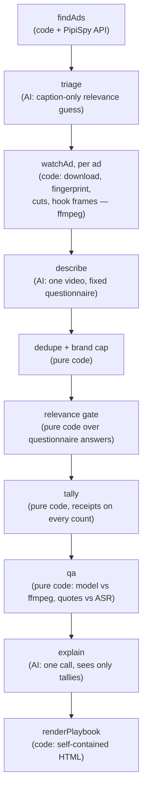

# Architecture

What the system is and where each behavior lives. For an engineer opening the
repo cold. The _why_ behind these choices lives in [decisions.md](decisions.md).

## The one rule

AI describes single ads. Code finds the patterns. AI explains the patterns.
The model that watches videos never sees two ads at once, so it cannot invent
market-level claims. The model that writes prose never sees a video — only
counted tallies, so every claim it makes has a count behind it. Everything in
between is deterministic TypeScript.

## Stages

## Stage map

| Stage      | File                | Job                                                                            | AI?                            |
| ---------- | ------------------- | ------------------------------------------------------------------------------ | ------------------------------ |
| entrypoint | `src/scan.ts`       | run every stage in order, report progress                                      | —                              |
| findAds    | `src/findAds.ts`    | pull six biased search angles of product ads, apply the 30/30 admission filter | one tiny call for sub-keywords |
| triage     | `src/triage.ts`     | order the watch queue, likely on-market first                                  | yes (captions only)            |
| watchAd    | `src/watchAd.ts`    | download once; fingerprint, cut count, hook frames, questionnaire              | calls describe                 |
| describe   | `src/describe.ts`   | one video model fills the questionnaire for one ad                             | yes (video)                    |
| dedupe     | `src/dedupe.ts`     | collapse re-uploads, cap ads per brand                                         | no                             |
| gate       | `src/gate.ts`       | reject ads that sell something off-market, with reasons                        | no                             |
| tally      | `src/tally.ts`      | count answers across the pool; every count keeps ad ids                        | no                             |
| qa         | `src/qa.ts`         | measure model drift vs ffmpeg and ASR transcripts                              | no                             |
| studyScore | `src/studyScore.ts` | rank ads for example lists (weights in constants)                              | no                             |
| explain    | `src/explain.ts`    | phrase counted patterns into chapters and tests                                | yes (tallies only)             |
| brief      | `src/brief.ts`      | rewrite the tests for one brand, still tally-bound                             | yes (tallies only)             |
| render     | `src/render/*.ts`   | assemble the playbook HTML with frame strips                                   | no                             |

Supporting modules: `src/constants.ts` (every threshold, with reasons),
`src/ad.ts` (the `Ad` type + PipiSpy mapper), `src/factSheet.ts` (the
questionnaire schema), `src/pipispy.ts` (API client + credit-saving cache),
`src/adDetail.ts` (permalink + spend estimate for exemplar ads, cached),
`src/openrouter.ts` (all model calls, schema-validated), `src/media.ts`
(everything that touches a video file), `src/dataDir.ts` (paths + JSON IO),
`src/progress.ts` (scan progress file).

Read the code in this order: `src/scan.ts` → `src/constants.ts` →
`src/findAds.ts` → `src/watchAd.ts` → `src/factSheet.ts` → `src/tally.ts` →
`src/render/playbook.ts`.

## The app

`app/` is a thin Next.js front door: the home page lists finished playbooks
and starts scans, `/api/scan` spawns `src/scan.ts` as a detached process,
`/scan/[slug]` polls `/api/progress`, `/playbooks/[slug]` shows the document
and hosts the brand brief form backed by `/api/brief`. No job table, no PID
tracking, no retry machinery — one scan per market at a time.

## Data on disk

Everything under `data/<market>/` is small and derived. Videos are never
persisted — each lives in a temp dir for the seconds one ad takes to process.

| Artifact                       | Path                                  | Invalidated by                                                                                                |
| ------------------------------ | ------------------------------------- | ------------------------------------------------------------------------------------------------------------- |
| raw search responses           | `data/<m>/searches/<paramsHash>.json` | new params (the recency cutoff rounds to the UTC day, so same-day re-runs hit the cache and spend no credits) |
| questionnaire per ad           | `data/<m>/factSheets/<adId>.json`     | `_schemaVersion` != `FACT_SHEET_SCHEMA_VERSION`                                                               |
| exemplar permalink + spend     | `data/<m>/details/<adId>.json`        | never (a fetched detail record is final)                                                                      |
| fingerprint + cut count per ad | `data/<m>/mechanicals.json`           | stored `sceneCutThreshold` != current constant                                                                |
| hook frames (webp, ~320px)     | `data/<m>/frames/<adId>/<n>.webp`     | never (re-extracted only if missing)                                                                          |
| tallies + prose for the app    | `data/<m>/tallies.json`               | overwritten each scan                                                                                         |
| scan progress                  | `data/<m>/progress.json`              | overwritten each scan                                                                                         |
| finished playbooks             | `examples/<m>.html`                   | overwritten each scan (committed — they are deliverables)                                                     |
